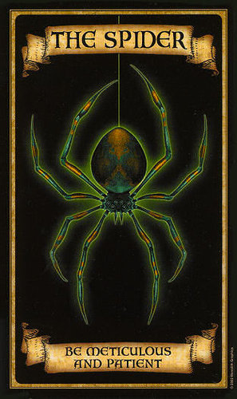

</br>

```
About The Spider.

The Spider generate config for V2ray, Sing-Box, Surfboard, and URL format as well.

He/She/It stole em all from The Fisherman, what a bad.
But, did the spider help us in 'some' things ?
I think no.

Anyway, i suggest you to meet The Fool, he is a fine folk. One of The Fisherman's friend
```

<div align=right>
    
    
    <a href="https://t.me/v2scrape"></a>

</div>

## Features

- [x] Support
  - [x] Vmess
  - [x] Trojan
  - [x] Shadowsocks(R)
  - [ ] Vless
- [x] Base64 Encoded Result
- [x] Speedtest

## How to add bugs

[Click this](AddBug.md)

## High Speed Nodes

<details>
  <summary>Click to show!</summary>
  <div align=center>
      <h3>Please read <a href="https://github.com/dickymuliafiqri/Spider/issues/27">this</a></h3>
  </div>
</details>

## License

You can read the license [here](LICENSE.md), also for additional information:

```
  This project JUST scrape/scavenge FREE things from the internet.
  I do not know from where and how "these" people get the "things".

  This project aimed to help communities from accessing internet on their own.
  The responsibility return to the end user and all credit return to people that hold the "things".
```
